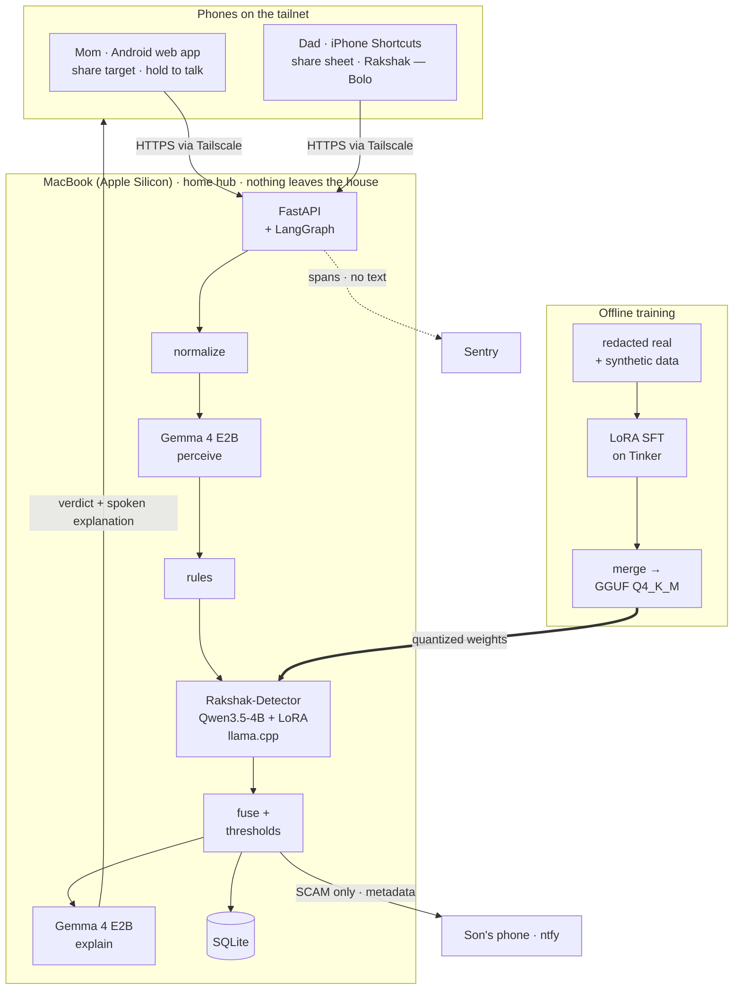

# Rakshak

A scam checker for my parents that runs on a MacBook at home.

My mom uses an Android phone and my dad uses an iPhone. Both get a steady stream of messages written to make a parent panic: fake KYC deadlines, parcels "held at customs", electricity cut off "tonight", fake police calls. Rakshak gives them a second opinion. Mom shares a message or screenshot to the Rakshak web app from her share sheet; Dad shares it to an iOS Shortcut. A few seconds later they see a large verdict card (scam, be careful, looks normal, or couldn't check) and hear a short spoken explanation in plain English. If it's a scam, my phone gets a notification that says which parent and what kind of scam, never the message itself. Every model runs on the Mac. The messages never leave the house.

The verdict comes from a small model fine-tuned for this one job (Qwen3.5-4B with a LoRA adapter), backed by a rules engine. Gemma 4 E2B reads screenshots and voice notes and writes the explanation. The explainer can't change the verdict, and if the detector is down the answer is "couldn't check", never "looks normal".

[PLACEHOLDER: banner or cover image from brand/]

## Contents

- [Architecture](#architecture)
- [Setup on Apple Silicon](#setup-on-apple-silicon)
- [Running it](#running-it)
- [Setting up the phones](#setting-up-the-phones)
- [Privacy design](#privacy-design)
- [Data card](#data-card)
- [Model card](#model-card)
- [Credits](#credits)
- [Commits after the deadline](#commits-after-the-deadline)
- [License](#license)

## Architecture

[PLACEHOLDER: architecture image docs/img/architecture.png]



One check runs as a LangGraph graph with a fixed order:

1. **normalize** (`hub/normalize.py`): Unicode NFKC, zero-width characters removed, whitespace collapsed; URLs, phone numbers, UPI handles and the sender header pulled out.
2. **perceive** (`hub/perception.py`, only for images and audio): Gemma 4 E2B transcribes a screenshot (via Ollama) or a voice note (via a second llama-server with Gemma's audio encoder). Tesseract and mlx-whisper are the fallbacks.
3. **rules** (`hub/rules.py`): pure functions, no I/O. Hard signals force SCAM: an `.apk` link, a look-alike of an official domain, or a request to enter a UPI PIN to *receive* money. Soft signals (unregistered sender claiming to be a bank, link shorteners, threat words, urgency plus payment, foreign number claiming Indian authority, asking for an OTP) push toward "be careful". Word lists cover English, Hinglish and Devanagari, because scam messages arrive in all three.
4. **detect** (`hub/detector.py`): the fine-tuned detector on llama-server returns JSON (verdict, category, red-flag quotes). `p_scam` comes from the verdict token's log-probabilities. Invalid JSON is retried once with schema-constrained decoding. Any red-flag quote that isn't an exact substring of the message is dropped.
5. **fuse** (`hub/fusion.py`): a hard rule means SCAM; otherwise `p_scam` is compared with two thresholds calibrated on the dev set (`config/thresholds.json`). If the detector is unavailable, the hub falls back to rules only and never answers SAFE.
6. **explain** (`hub/explainer.py`): Gemma turns the verdict into at most three short sentences. A post-check requires the verdict word, rejects any link or number not in the input, and caps the length; otherwise a fixed template is used. "Looks normal" and "couldn't check" always use templates.
7. **notify / store** (`hub/alerts.py`, `hub/db.py`): SCAM sends an ntfy push with parent, category and time only. Everything is stored in a local SQLite file.

The hub also serves the built web app (`pwa/dist`), the verdict page `/v/{event_id}` that Dad's shortcut opens in Safari, and a metadata-only status page at `/status`.

## Setup on Apple Silicon

Tested on a MacBook Pro M3 Pro with 18 GB of memory. Plan for about 30 GB of free disk. With the detector (Q4_K_M), Gemma in Ollama and the Gemma audio server all loaded, resident memory is about [PLACEHOLDER: resident memory with all three servers, GB].

### 1. Tools

```bash
brew install uv node ollama llama.cpp tesseract tesseract-lang ffmpeg jq
brew install --cask tailscale      # or the Mac App Store version
```

`brew install llama.cpp` gives you `llama-server` and `llama-quantize`. Converting Hugging Face weights to GGUF needs the llama.cpp source and its Python requirements, kept in their own virtual environment:

```bash
git clone https://github.com/ggml-org/llama.cpp ~/src/llama.cpp
uv venv ~/src/llama.cpp/.venv
source ~/src/llama.cpp/.venv/bin/activate
uv pip install -r ~/src/llama.cpp/requirements/requirements-convert_hf_to_gguf.txt
deactivate
```

Use a recent Ollama from Homebrew. Older Ollama app builds can't pull `gemma4`; if one is installed, remove or update it so it doesn't shadow the Homebrew binary.

### 2. Python environment

```bash
git clone https://github.com/MuaazSM/rakshak && cd rakshak
uv sync                    # hub, rules, eval
uv sync --extra train      # + tinker, tinker-cookbook, transformers, peft (training and export)
uv sync --extra mlx        # + mlx-lm, mlx-whisper (fallbacks)
```

### 3. Models

```bash
# Gemma 4 E2B for screenshots and explanations
ollama pull gemma4:e2b

# Gemma 4 E2B GGUF with the audio encoder, for voice notes (audio is experimental in llama.cpp)
uv run --extra train hf download ggml-org/gemma-4-E2B-it-GGUF \
  gemma-4-E2B-it-Q4_0.gguf mmproj-gemma-4-E2B-it-Q8_0.gguf --local-dir models/gemma-audio

# Base Qwen3.5-4B weights (for merging the adapter and for the few-shot baseline)
uv run --extra train hf download Qwen/Qwen3.5-4B --local-dir models/base/qwen3.5-4b
```

The fine-tuned adapter is not published (see the [data card](#data-card)), so the detector GGUF has to come from your own training run:

```bash
# merge the downloaded LoRA adapter into the base weights first, then:
~/src/llama.cpp/.venv/bin/python ~/src/llama.cpp/convert_hf_to_gguf.py <merged-model-dir> \
  --outtype f16 --outfile models/rakshak-detector-v1-f16.gguf
llama-quantize models/rakshak-detector-v1-f16.gguf models/rakshak-detector-v1-q4km.gguf Q4_K_M
```

To try the hub without training, `bash scripts/smoke/qwen_gguf.sh` converts and quantizes the base model to `models/base/qwen3.5-4b-q4km.gguf`; point `DETECTOR_GGUF` at that file. The base model is slower and less accurate (see the results table), but the whole pipeline runs.

Stop all model servers while merging an adapter: the bf16 merge needs about 9 GB on its own.

### 4. Configuration

```bash
cp .env.example .env
cp config/parents.example.json config/parents.json
```

In `.env`, the values that matter most:

| Variable | Set it to |
|---|---|
| `OCR_FALLBACK` | `gemma` (Gemma reads screenshots; `tesseract` is the fallback) |
| `ASR_FALLBACK`, `GEMMA_AUDIO_URL` | `gemma` and `http://127.0.0.1:8082/v1`, or `mlx-whisper` and blank |
| `DETECTOR_URL`, `DETECTOR_GGUF`, `DETECTOR_VERSION` | the llama-server address (`http://127.0.0.1:8081/v1`) and your GGUF |
| `HUB_HOST` | `127.0.0.1` (the settings loader refuses `0.0.0.0`) |
| `PUBLIC_BASE_URL` | the `https://…ts.net` address printed by `tailscale serve status` |
| `NTFY_TOPIC` | an unguessable topic, e.g. `python3 -c "import secrets; print('rakshak-' + secrets.token_urlsafe(12))"` |
| `SENTRY_DSN` | optional; leave blank to turn tracing off |
| `RAKSHAK_CANARY` | any unique string, used by the privacy test |
| `TINKER_API_KEY`, `HF_TOKEN` | only needed for training and downloads |

`config/parents.json` holds one profile per parent: an id (`mom`, `dad`), a display name, age, explanation language (`en` by default) and device (`android` or `ios`). Both files are git-ignored.

### 5. Start everything

Each in its own terminal (or with `&`):

```bash
# Gemma via Ollama; parallel slots so perception and explanation don't queue behind each other
OLLAMA_NUM_PARALLEL=4 ollama serve

# Detector on :8081
llama-server -m "$DETECTOR_GGUF" --host 127.0.0.1 --port 8081 -ngl 99 --jinja -c 4096

# Gemma audio on :8082 (skip if ASR_FALLBACK=mlx-whisper)
llama-server -m models/gemma-audio/gemma-4-E2B-it-Q4_0.gguf \
  --mmproj models/gemma-audio/mmproj-gemma-4-E2B-it-Q8_0.gguf \
  --host 127.0.0.1 --port 8082 -ngl 99 --jinja -c 4096

# Build the web app, then start the hub on localhost
(cd pwa && npm install && npm run build)
uv run uvicorn hub.app:app --host 127.0.0.1 --port 8000

# Publish the hub to your tailnet over HTTPS (never use `tailscale funnel`)
tailscale serve --bg 8000

# Keep the Mac awake while it's the hub
caffeinate -dimsu &
```

Check `http://127.0.0.1:8000/health` for model status and recent latency, and `/status` for a summary of today's checks. The "Call" button on the verdict card reads a phone number from `VITE_SON_PHONE` at build time; without it the button is hidden.

## Running it

```bash
uv sync
uv run pytest -q
uv run ruff check . && uv run ruff format .
uv run uvicorn hub.app:app --host 127.0.0.1 --port 8000 --reload
cd pwa && npm run build
```

A quick check from the Mac:

```bash
curl -s http://127.0.0.1:8000/api/check -H 'content-type: application/json' \
  -d '{"parent_id":"mom","channel":"sms","text":"Your parcel is held at customs. Pay Rs 49 at http://bit.ly/x to release it."}' | jq
```

Data, training and evaluation:

```bash
uv run python -m training.redact                     # mask real messages before they leave data/raw/
uv run python -m training.label                      # label redacted items in the terminal
uv run python -m training.freeze_test                # freeze and hash the real-only test set
uv run python -m training.synth --batch-id batch1    # synthetic variants with Gemma (local)
uv run python -m training.build_dataset              # dedupe, split by seed group, write splits.lock.json
uv run --extra train python -m training.train_tinker --dry-run          # token count and cost estimate
uv run --extra train python -m training.train_tinker --run-name full    # LoRA SFT on Tinker

uv run python -m eval.baselines --build-fewshot      # six fixed few-shot examples from train
uv run python -m eval.run_eval --systems rules_only,gemma_zeroshot,qwen_base_fewshot --split dev
uv run python -m eval.run_eval --table               # print the ablation table from eval/results/
uv run python -m eval.calibrate --split dev          # write T_HIGH / T_LOW to config/thresholds.json
```

Eval scripts use fixed seeds, write JSON to `eval/results/`, and never print message text. The test split is refused unless it exists and `--i-am-the-final-eval` is passed; it is run once, at the end. Thresholds come from the dev split only.

## Setting up the phones

- **Android (web app + share target):** [`notes/android_setup.md`](notes/android_setup.md) covers `tailscale serve`, installing the web app from `PUBLIC_BASE_URL/?parent=mom` in Chrome, and checking that Rakshak shows up in the share sheet.
- **iPhone (two Shortcuts):** [`notes/iphone_setup.md`](notes/iphone_setup.md) builds **Rakshak** (share sheet, text or screenshot → `POST /api/share`) and **Rakshak — Bolo** (record audio → `POST /voice`). Each shows an alert with the verdict, speaks the explanation with Speak Text, and opens the same verdict card in Safari.

Both phones need the Tailscale app, signed in to the same tailnet as the Mac. Explanations are in English by default; Hindi can be chosen as a setting.

## Privacy design

- **Local inference only.** At runtime the hub talks to Ollama and two llama-server processes on `127.0.0.1`, and nothing else sees message content. There are no cloud model calls.
- **Local network only.** The hub binds to `127.0.0.1`. Phones reach it through `tailscale serve` inside a private tailnet, not the public internet.
- **Metadata-only alerts.** The ntfy push says "{name} got a likely SCAM ({category}) at {HH:MM}. Call them." and nothing more.
- **Metadata-only tracing.** Sentry gets one transaction per check and one span per pipeline node. Span attributes come from a fixed allowlist (node, model and version, token counts, latency, verdict, category, `p_scam`, rule-signal names, retry count, error type). `send_default_pii` is off, local variables and request bodies are not captured, and a `before_send` / `before_send_transaction` / `before_breadcrumb` hook removes any `text`, `raw_text`, `message`, `explanation`, `quote`, `red_flags`, `audio` or `image` key at any depth.
- **Canary test.** `tests/test_privacy.py` sends a fake message containing a canary string through the real app on every input path (`/api/check`, `/api/share` text and image, `/voice`, `/share`). It captures every Sentry envelope, every outbound HTTP request, every log record and the console, and fails if the canary appears in any of them or if anything connects to a host other than the local model servers and ntfy.
- **Media.** Screenshots and voice notes are deleted after transcription unless `KEEP_MEDIA=true`. Message text stays in the local SQLite file.
- **Git-ignored:** `data/raw/`, `data/redacted/`, the split and synthetic JSONL files, `data/redaction_names.txt`, `config/parents.json`, `.env`, `var/` (database, media), `media/`, `models/` and `*.db`.
- **Advice only.** Rakshak never blocks, replies, pays or contacts anyone except the son's alert. Under any failure it gets more cautious, never more confident.

## Data card

**Labels.** Verdict (`SCAM`, `SUSPICIOUS`, `SAFE`), a category (12 scam types such as `digital_arrest`, `kyc_account_block`, `malicious_apk`, `electricity_disconnect`, `courier_parcel`, `upi_collect_refund`; 6 safe types such as `genuine_otp`, `transaction_alert`, `delivery_update`), and red-flag quotes, each an exact substring of the message, with a reason. SUSPICIOUS is kept for genuinely ambiguous items.

**Sources.**

| Source | Count | Used for |
|---|---|---|
| Real scam messages from family phones (with consent) | [PLACEHOLDER: count] | Mostly test |
| Real genuine messages from my own inbox (OTPs, debits, deliveries, government) | [PLACEHOLDER: count] | Test hard negatives and train |
| Public fraud advisories (RBI, CERT-In, cybercrime.gov.in, bank pages), paraphrased | [PLACEHOLDER: count] | Seeds and a separate eval slice |
| Synthetic variants | [PLACEHOLDER: count] | Train and dev only |

Messages are in English, Hinglish and Devanagari: [PLACEHOLDER: language mix of the test set].

**Redaction** (`training/redact.py`). Every real message is redacted before it leaves `data/raw/`, then checked by hand. Personal phone numbers become `<PHONE>`; scammer numbers keep the country code and first four digits. OTP and PIN digits become `<OTP>`; account, card and reference numbers become `<ACCT>`; family names and addresses (from a git-ignored list) become `<NAME>` and `<ADDR>`. Amounts, scam links and domains, scammers' UPI handles and sender headers are kept, because they are the signal.

**Synthetic generation** (`training/synth.py`). Generated locally by Gemma 4 E2B, an open-weight model, through Ollama. A small set of short seed patterns ([PLACEHOLDER: number of seeds]), drafted with an AI assistant and never used as training examples themselves, is expanded by Gemma into new scenarios, then into variants across language, obfuscation (misspellings, spacing, emoji, look-alike characters, shortened links) and channel. Hard negatives are genuine-style messages with alarming wording ("Do not share this OTP", "a/c debited"). Every red-flag quote must be an exact substring of the generated text or the item is dropped. A 10% sample of each batch is set aside for a hand check: [PLACEHOLDER: hand-check result per batch]. Near-duplicates (MinHash over character 5-grams, Jaccard ≥ 0.8) are removed.

**Splits** (`training/build_dataset.py`, `training/freeze_test.py`). The test set is real messages only, never used as seeds, and frozen and hashed (`data/splits/splits.lock.json`) before the training runs that are reported. Until real messages are added, train and dev are synthetic, the lock file is marked provisional, and nothing measured on them is reported as a result. Train and dev are split by seed group so variants of one seed never cross splits, and a final MinHash check drops any training item too close to a test item. 20% of training inputs have their rule signals blanked so the model doesn't lean on them. Sizes: train [PLACEHOLDER: n], dev [PLACEHOLDER: n], test [PLACEHOLDER: n scam / n genuine / n hard negatives].

**Why the data and adapter aren't published.** The real messages come from my family's phones and my inbox. Even redacted, they're private, and a model fine-tuned on them can memorize fragments. So neither the dataset nor the trained adapter is released. The code, prompts, word lists and pipeline are all here; with your own messages you can rebuild the whole thing.

## Model card

**Rakshak-Detector**

| | |
|---|---|
| Base | `Qwen/Qwen3.5-4B`, thinking mode off in training and inference |
| Method | LoRA SFT on [Tinker](https://thinkingmachines.ai/tinker/), loss on assistant tokens only |
| LoRA rank | 32 |
| Learning rate | `tinker_cookbook.hyperparam_utils.get_lr(base)`: [PLACEHOLDER: value] |
| Batch / epochs | 32 / 3, dev eval each epoch, best epoch by dev macro-F1 then scam recall |
| Max sequence length | 1,024 tokens |
| Rule-signal dropout | 20% of training inputs |
| Training cost | [PLACEHOLDER: Tinker spend, USD] |
| Served as | merged, converted to GGUF, quantized to Q4_K_M ([PLACEHOLDER: size on disk, GB]), llama-server with Metal |
| Input | channel, sender and whether it's registered, rule-signal names, the normalized message |
| Output | JSON: `verdict`, `category`, `red_flags` (`quote`, `reason`) |

**Gemma 4 E2B** (`gemma4:e2b`, not fine-tuned) has two jobs: transcribing screenshots and voice notes, and turning the detector's verdict into a short explanation. Tinker doesn't offer Gemma, so the fine-tuned specialist is Qwen and Gemma does what it's good at: images, audio and plain-language writing. Gemma gets the verdict as fixed input and can't change it; its explanation is post-checked and replaced by a template if the check fails.

**Results** on the real test set ([PLACEHOLDER: n] messages), with 95% bootstrap confidence intervals (1,000 resamples). Scam recall counts SCAM or SUSPICIOUS on a real scam, since both put a warning in front of the parent.

| System | Scam recall | FPR genuine | FPR hard negatives | Macro-F1 | Span F1 | p95 latency | Size |
|---|---|---|---|---|---|---|---|
| Rules only | [PLACEHOLDER: value (95% CI)] | [PLACEHOLDER: value (95% CI)] | [PLACEHOLDER: value (95% CI)] | [PLACEHOLDER: value (95% CI)] | — | [PLACEHOLDER: ms] | — |
| Gemma 4 E2B zero-shot | [PLACEHOLDER: value (95% CI)] | [PLACEHOLDER: value (95% CI)] | [PLACEHOLDER: value (95% CI)] | [PLACEHOLDER: value (95% CI)] | [PLACEHOLDER: value] | [PLACEHOLDER: ms] | [PLACEHOLDER: GB] |
| Qwen3.5-4B base, few-shot | [PLACEHOLDER: value (95% CI)] | [PLACEHOLDER: value (95% CI)] | [PLACEHOLDER: value (95% CI)] | [PLACEHOLDER: value (95% CI)] | [PLACEHOLDER: value] | [PLACEHOLDER: ms] | [PLACEHOLDER: GB] |
| Qwen3.5-4B + Tinker LoRA | [PLACEHOLDER: value (95% CI)] | [PLACEHOLDER: value (95% CI)] | [PLACEHOLDER: value (95% CI)] | [PLACEHOLDER: value (95% CI)] | [PLACEHOLDER: value] | [PLACEHOLDER: ms] | [PLACEHOLDER: GB] |
| **Full Rakshak** (rules + detector + fusion) | [PLACEHOLDER: value (95% CI)] | [PLACEHOLDER: value (95% CI)] | [PLACEHOLDER: value (95% CI)] | [PLACEHOLDER: value (95% CI)] | [PLACEHOLDER: value] | [PLACEHOLDER: ms] | [PLACEHOLDER: GB] |

Base vs tuned detector, McNemar's exact test: [PLACEHOLDER: p-value]. JSON validity of the tuned detector: [PLACEHOLDER: %]. Grounding rate before the substring filter: [PLACEHOLDER: %]. End-to-end p95 on the M3 Pro: text [PLACEHOLDER: s], screenshot [PLACEHOLDER: s], voice [PLACEHOLDER: s]. Thresholds `T_HIGH` = [PLACEHOLDER: value] and `T_LOW` = [PLACEHOLDER: value], calibrated on dev.

[PLACEHOLDER: per-language and per-category slice chart docs/img/slices.png]

**Limitations.**

- The test set is small ([PLACEHOLDER: n]), so the confidence intervals are wide. Read the numbers as "how it does on the messages my family actually gets", not as a benchmark.
- Most training data is synthetic. The real scams that reach a family next month may not look like the ones it was trained on.
- It only checks what a parent chooses to share. It does not read incoming messages on its own and can't listen to phone calls; a parent describes the call afterwards.
- Gemma's audio support in llama.cpp is experimental, and a screenshot transcription can be wrong. A transcription error becomes a detection error.
- The rules know Indian banks, government domains and scam patterns. They won't transfer to other countries without new word and domain lists.
- It runs on one Mac. If the Mac is asleep or off, the phones get "couldn't check".

## Credits

Rakshak builds on these open-source projects:

- [llama.cpp](https://github.com/ggml-org/llama.cpp): `llama-server`, GGUF conversion (`convert_hf_to_gguf.py`) and quantization
- [Ollama](https://github.com/ollama/ollama): local Gemma serving
- [Gemma 4](https://ai.google.dev/gemma) (Google) and [Qwen3.5](https://huggingface.co/Qwen) (Alibaba Qwen team): model weights
- [Tinker](https://thinkingmachines.ai/tinker/) and [tinker-cookbook](https://github.com/thinking-machines-lab/tinker-cookbook): training API, renderers, SFT data helpers and learning-rate defaults
- [Hugging Face transformers](https://github.com/huggingface/transformers), [PEFT](https://github.com/huggingface/peft), [huggingface_hub](https://github.com/huggingface/huggingface_hub): adapter merge and downloads
- [MLX-LM](https://github.com/ml-explore/mlx-lm) and [mlx-whisper](https://github.com/ml-explore/mlx-examples): fallbacks on Apple Silicon
- [LangGraph](https://github.com/langchain-ai/langgraph): the check pipeline
- [FastAPI](https://github.com/fastapi/fastapi), [Uvicorn](https://github.com/encode/uvicorn), [pydantic](https://github.com/pydantic/pydantic) and pydantic-settings, [python-multipart](https://github.com/Kludex/python-multipart), [HTTPX](https://github.com/encode/httpx)
- [datasketch](https://github.com/ekzhu/datasketch) (MinHash), [RapidFuzz](https://github.com/rapidfuzz/RapidFuzz) (edit distance), [tldextract](https://github.com/john-kurkowski/tldextract), [idna](https://github.com/kjd/idna), [NumPy](https://numpy.org), [SciPy](https://scipy.org)
- [Tesseract](https://github.com/tesseract-ocr/tesseract) and [pytesseract](https://github.com/madmaze/pytesseract), [FFmpeg](https://ffmpeg.org)
- [sentry-sdk](https://github.com/getsentry/sentry-python), [ntfy](https://ntfy.sh), [Tailscale](https://tailscale.com)
- [React](https://react.dev), [React Router](https://reactrouter.com), [TanStack Query](https://tanstack.com/query), [Vite](https://vite.dev), [vite-plugin-pwa](https://github.com/vite-pwa/vite-plugin-pwa), [Workbox](https://github.com/GoogleChrome/workbox), [TypeScript](https://www.typescriptlang.org)
- [Lucide](https://lucide.dev) icons (ISC license)
- Fonts from Google Fonts: [Mukta](https://fonts.google.com/specimen/Mukta), [Yatra One](https://fonts.google.com/specimen/Yatra+One), [JetBrains Mono](https://fonts.google.com/specimen/JetBrains+Mono) (SIL Open Font License)
- Development tooling: [uv](https://github.com/astral-sh/uv), [Ruff](https://github.com/astral-sh/ruff), [pytest](https://pytest.org)

No third-party source code is copied into this repository beyond what these packages provide; icon paths are Lucide's.

## Commits after the deadline

The challenge deadline was Mon 5 Oct 2026, 06:59 UTC. Commits after it:

None yet.

## License

[PLACEHOLDER: license]
